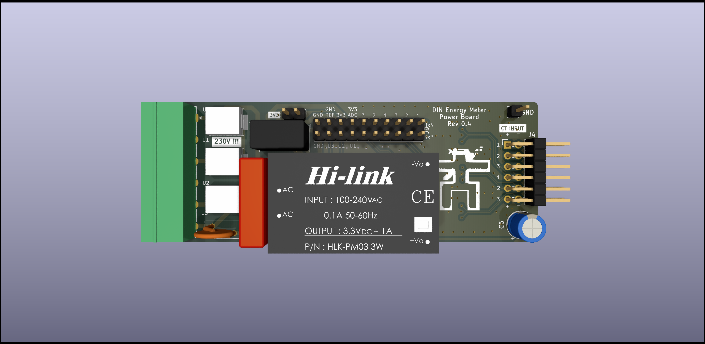

# DIN Energy Meter

**this is Work In Progress, not yet stable HW/SW**

DIN Energy Meter fitting 2-unit enclosure. Features
 - 6-circuit 3-phase 
 - CT-based (external current transformers needed)
 - ESP32 as a main MCU (WiFi)
 - ATM90E32 x2 as a metering IC
 - optional display + buttons

# Hardware

TODO: 3D model of full device

For details see [Hardware README](hardware/README.md)

# Current status

## Hardware

   - **Power board** - v0.4 prototype (not assembled)
   - **Metering board** - v0.4 prototype (assembled, in test)
   - **MCU board** - breadboard prototyping

## Software
   - basic **Metering board** test with Arduino framework done

# Inspiration

This project is heavily inspired by previous work, mainly:
 - [DIN_Rail_EnergyMonitor](https://github.com/whatnick/DIN_Rail_EnergyMonitor/) by [@whatnick](https://github.com/whatnick)
 - [Expandable 6 Channel ESP32 Energy Meter](https://github.com/CircuitSetup/Expandable-6-Channel-ESP32-Energy-Meter) by [CircuitSetup](https://github.com/CircuitSetup)