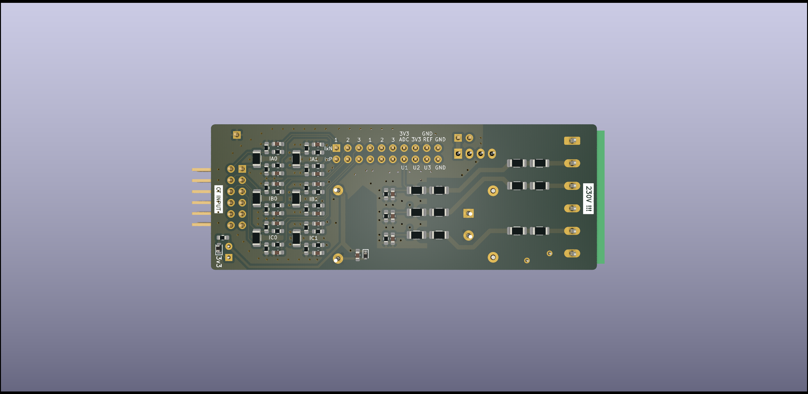
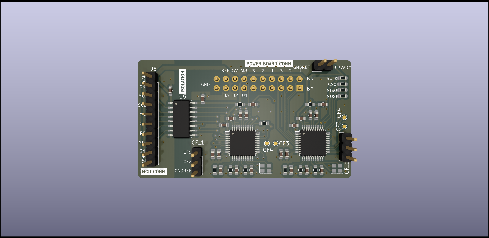
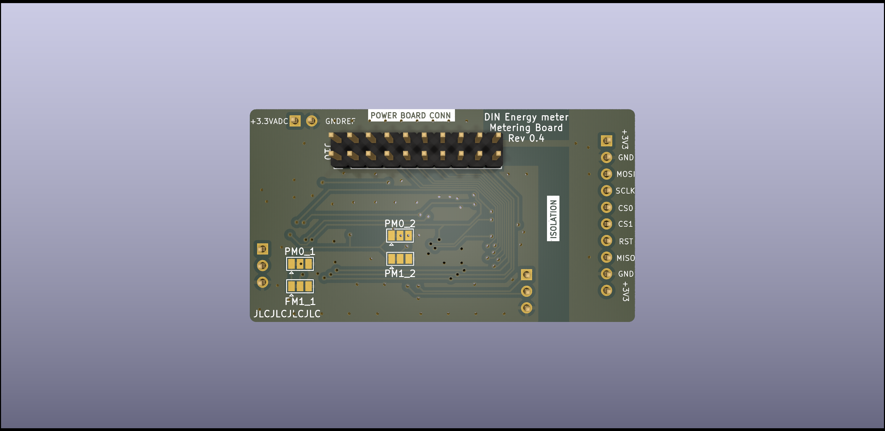

# Kicad project of DIN Energy Meter

TODO: describe how to import into clean KiCad

Done in KiCad 7.0, multi-board design in hierarchical sheet. Splitting to multiple boards is done by kikit (see `split_boards.sh` for details).

# Power Board

 - Single-phase 230V AC to 3v3 DC
 - isolated 3v3 to 3v3 for power separation between ADCs and MCU
 - fliters and burden resistors for CT input
 - 2x10 2.54mm GPIO header for connecting with the **Metering Board**

# Metering Board

 - 2x ATM90E32 for energy measurement
 - CF1/2 on GPIO headers for accuracy measurement (CF3/4 on testpoints)
 - Power Manager selectors on solder jumpers
 - isolated SPI for MCU connection
 - 2x10 2.54mm GPIO header for connecting with the **Power Board**
 - 1x10 2.54mm GPIO header for connection with the **MCU board**

# MCU Board

TODO